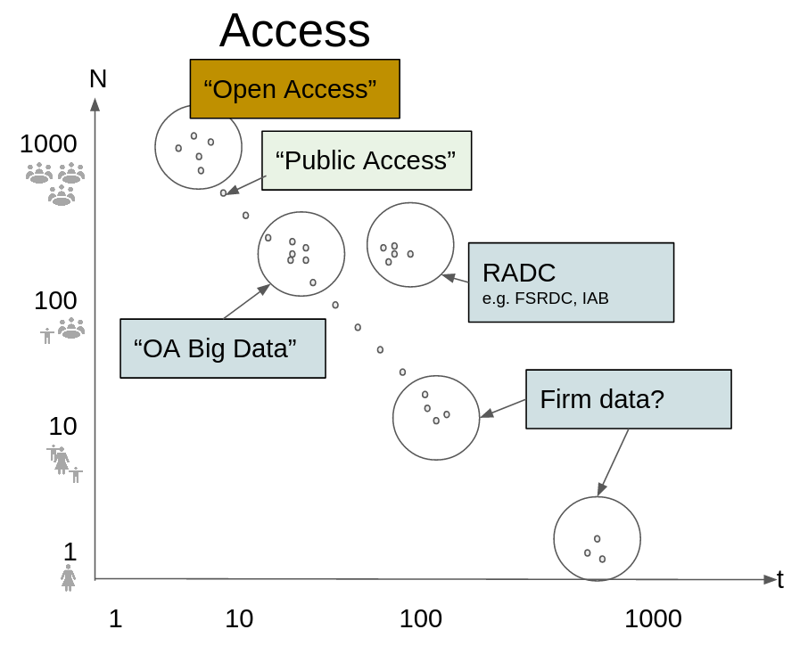

# What is Open Science?

## What is Open Science?

Usually described along several pillars:

- Open **access** to publications
- Open **data**
- Open **code / software**
- Open **methods** and **peer review**

## Open Science and Credibility

> Open Science facets are seen as **good**, and a (possibly) necessary part of **credible research**

## Open Science and Policy {.orange}

Should policy be based on *credible* research, and thus on **open science**?

## Why Data Access Is the Hard Part

- **Manuscripts**: increasingly open (preprints, open access mandates)
- *Code*: cheap to share, easy to version, low legal risk
- **Data**: the sticking point

## Recent Evidence

A 2026 issue of *Nature* on social science reproducibility:

::::{.columns}

::: {.column width="50%}

- Headline: **"Half of social-science studies fail replication test"**
  - But: only *30% of articles yielded data*

:::
::: {.column width="50%}

:::
::::

## Let's make that a bit bigger

## Why is data not always open?

:::: {.columns}
::: {.column width="70%}

- Data withheld for *ethical*, legal, or contractual reasons
- May be **confidential**, proprietary, or administrative

:::
::: {.column width="30%}

:::
::::

## Ask yourself! {.orange}

::::{.columns}

::: {.column width="50%}

Would you want

- your complete medical history
- your precise address

to be made *public*?

:::

:::{.column width="50%}

:::
::::

## Probably not {.orange}

## So: Open Science and Policy

:::{.warning}

Should policy be based on *credible* research, and thus on **open science**,...

:::

when

:::{.warning}
 **open science** == **open data**?
:::

## Open Access and Politics

But this is exactly what certain critics of **environmental** policies have suggested in the US.

## Open Access and Politics

> No health data... no health effects of pollution... no "costly" environmental regulations

## Data Access as the Bottleneck

- *Access* — not mere existence — determines whether findings can be verified

::: {.warning}
Without access to the underlying data, **code and methods alone cannot establish reproducibility** — verification becomes much harder.
:::

## How do you do open science when data are not "freely available"?

