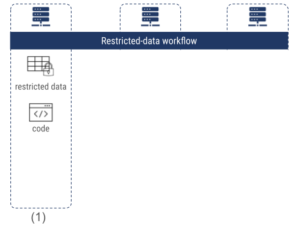
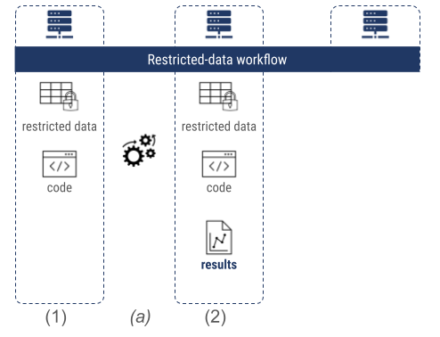
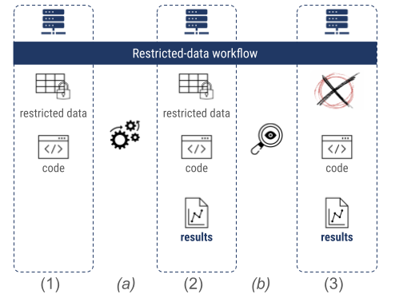
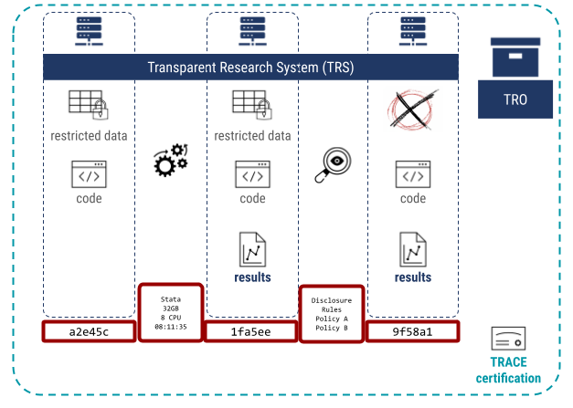

# The TRACE Framework

## What is TRACE?

**TRACE** = Transparency Certified

A framework that allows inquiry into the reproducibility workflow **at any stage** — without requiring re-running the code.

## Key insight

Document the *process*, not just the *outputs*

- **File arrangements** (manifests with checksums)
- **Processing steps** (software, timing, method, isolation)
- **Cryptographic signatures** by certifying organizations

## Result

**TRACE-compliant packages can be:**

- Compared across services (Codeocean vs. World Bank)
- Inspected both by humans and automated scripts
- Trusted via organizational credibility chains

## Generic Workflow (Before TRACE) {.smaller}

::: {.columns}
::: {.column width="55%"}

Consider a researcher using confidential data in a Restricted Access Data Center (RADC):

1. Researcher gets environment with confidential data, writes code

:::
::: {.column width="45%"}

:::
:::

## Generic Workflow (Before TRACE) {.smaller}

::: {.columns}
::: {.column width="55%"}

Consider a researcher using confidential data in a Restricted Access Data Center (RADC):

1. Researcher gets environment with confidential data, writes code
2. Code is executed (a) → output produced

:::
::: {.column width="45%"}

:::
:::

## Generic Workflow (Before TRACE) {.smaller}

::: {.columns}

::: {.column width="55%"}

Consider a researcher using confidential data in a Restricted Access Data Center (RADC):

1. Researcher gets environment with confidential data, writes code
2. Code is executed (a) → output produced
3. Data custodian inspects, removes confidential data (b)
4. Researcher receives code + output only (arrangement 3)

:::
::: {.column width="45%"}

:::
:::

## Generic Workflow (Before TRACE)

::: {.columns}
::: {.column width="55%"}

**Problem:** 

- The World Bank certificate states in English that this process was followed. 
- Codeocean points to an FAQ. 

**Neither is verifiable or machine-readable.**

:::
::: {.column width="45%"}

:::
:::

# Making a Workflow TRACE-Compliant

## Making a Workflow TRACE-Compliant

::: {.columns}
::: {.column width="55%" .incremental}

Add a few computationally easy steps:

1. Document each **file arrangement** (1, 2, 3) with manifests + checksums
2. Describe each **processing step** (software-driven or manual) with salient info

:::
::: {.column width="45%"}

:::
:::

## Making a Workflow TRACE-Compliant

::: {.columns}
::: {.column width="55%" .incremental}

Add a few computationally easy steps:

3. Express in a **controlled vocabulary** (TROV)
4. Wrap everything into a package with a **cryptographic signature** → creates a **TRO**

:::
::: {.column width="45%"}

:::
:::

# Scenarios TRACE Addresses

## SCN3 — Restricted access data environments

::: {.highlight-box}

RADCs have no vested interest in any particular paper — they satisfy the arms-length requirement. 

:::

Partners at **central banks** (and World Bank!) are already implementing TRACE-compliant capabilities.

