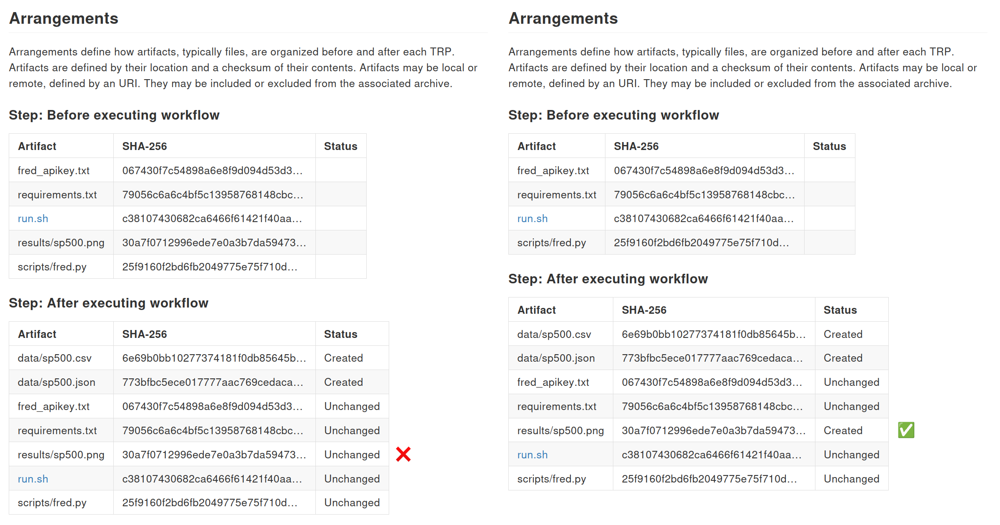

# TROV, TRO, and TRS

## The Three Core Concepts

| Acronym | Name | Description |
|---------|------|-------------|
| **TROV** | TRO Vocabulary | Controlled vocabulary for describing computational processes |
| **TRO** | Trusted Research Object | A replication package described using TROV |
| **TRS** | Trusted Research System | The system or process used to create a TRO |

## What is a TRO?

A **TRO** is a replication package that contains:

- All **code** used in the analysis
- All **outputs** produced
- A **system description** (core features of the environment)
- Information about **how files changed** across arrangements
- **Organizational signatures** — cryptographically signed affirmations

## What is a TRO?

::: {.warning}
Important limitation
:::

The organization only asserts that *its process was followed* — it does **not** assert scientific correctness or endorse findings.

## The Trust Chain

TROs must be issued by **organizations** (not individuals):

1. A journal accepts its first TRO → verifies the producing organization's process meets its standards
2. Journal publishes the TRO → adds another layer of credibility
3. Other journals and researchers can rely on that credibility **without further verification**

## The Trust Chain

This mirrors:

- **PGP** "circle of trust"
- **Web PKI** — chain of certificate authorities down to root CA

Institutions emitting TROs have strong incentives to **maintain trust** — their credibility depends on it.

## Example

## What TROs Do and Don't Do {.smaller}

::: {.columns}
::: {.column width="50%"}

**TROs can:**

- *Confirm* that artifacts not present initially were created by the provided code
- *Enable* principled compliance checking for data/code availability policies
- *Allow* human and automated comparison across services
- *Provide* file checksums that detect unauthorized modification

:::
::: {.column width="50%"}

**TROs cannot:**

- *Confirm* completeness of the replication package
- *Confirm* correctness of the analysis
- *Replace* journal inspection for policy compliance
- *Guarantee* scientific validity

:::
:::
