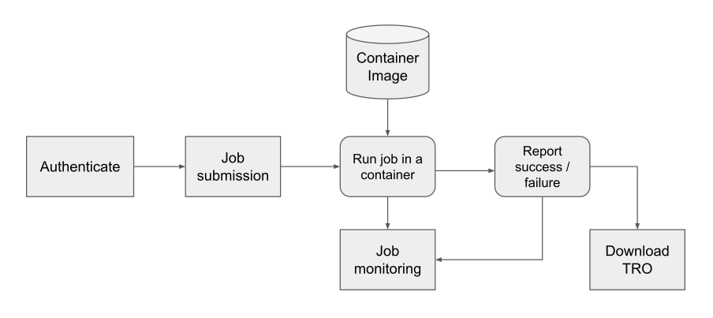
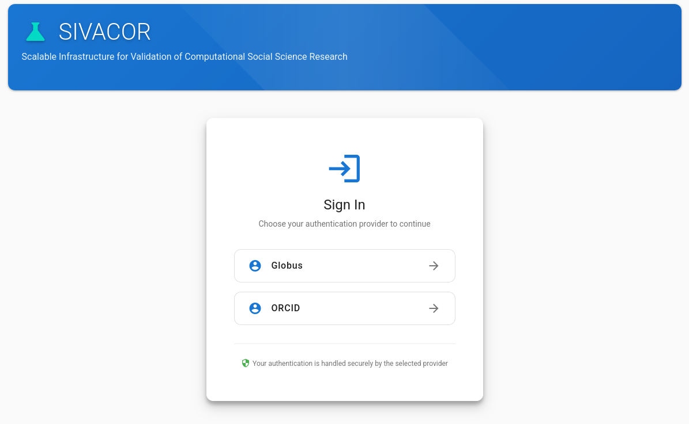
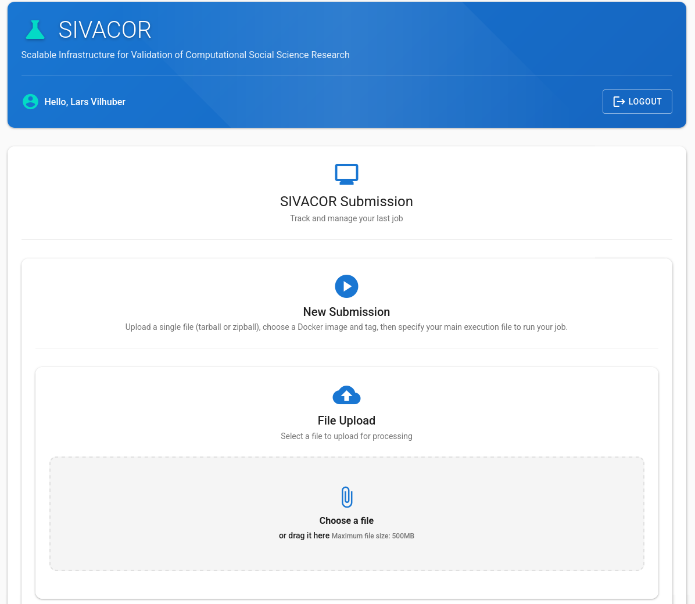
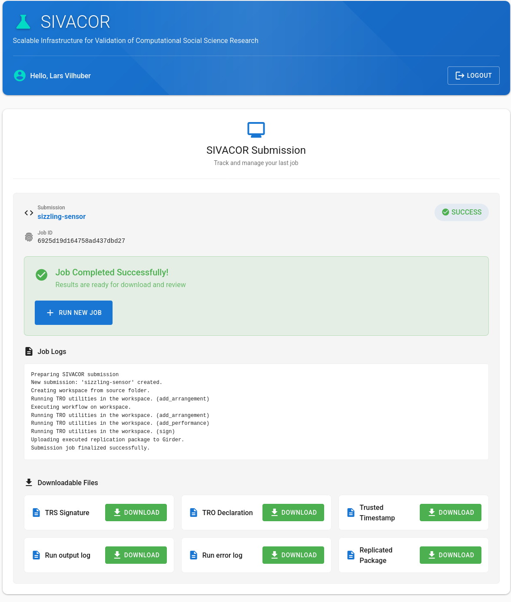

# SIVACOR

## The Reference Implementation

**SIVACOR** is the reference implementation of a TRACE-compliant Trusted Research System (TRS).

## Live

---

---

## Who runs SIVACOR?

A SIVACOR instance is run by a **trusted organization** 

- journal
- university
- research institution hosting other researchers

## What SIVACOR Provides

SIVACOR allows authors to:

1. Demonstrate **push-button reproducibility** in a transparent environment
2. Fix minor bugs **before submission** — without journal resources
3. Receive a **TRACE-compliant TRO** with organizational signature

## What SIVACOR Provides

For journals:

- Packages arrive **already verified**
- TRACE metadata is machine-readable and comparable
- Works for journals **with and without** dedicated data editors

## The Bigger Picture

::: {.fragment}
::: {.highlight-box}
Universities, research data centers, and compute facilities become **producers of credibility** — not just reproducibility services.
:::
:::
