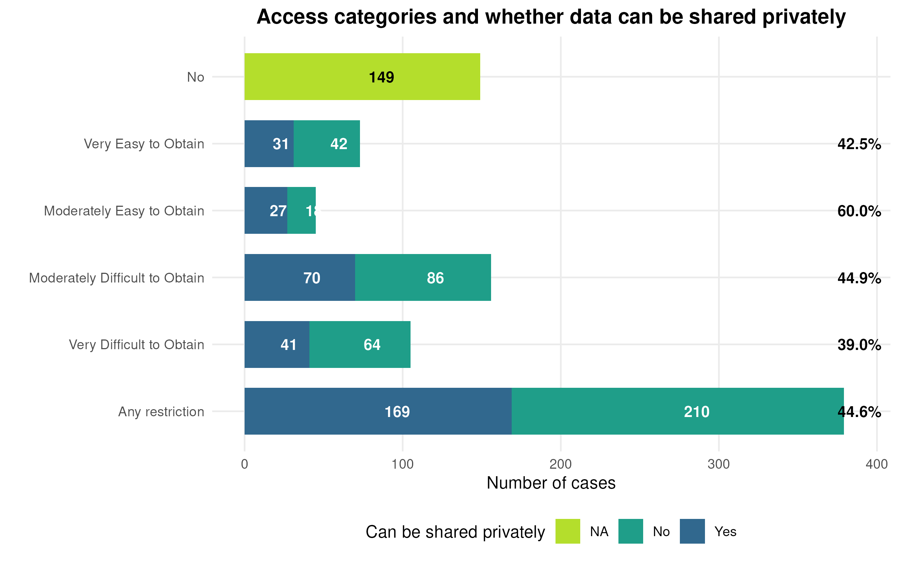

# The Problem

## Recent Evidence

A 2026 issue of *Nature* on social science reproducibility:

::::{.columns}

::: {.column width="50%}

- Headline: **"Half of social-science studies fail replication test"**
  - But: only 30% of articles yielded data; *only 24% were attempted*
  

:::
::: {.column width="50%}

:::
::::

## Recent Evidence

A 2026 issue of *Nature* on social science reproducibility:

::::{.columns}

::: {.column width="50%}

- Headline: **"Half of social-science studies fail replication test"**
  - But: only 30% of articles yielded data; only 24% were attempted
  - *74% of those attempted* were exactly or approximately *reproducible*

:::
::: {.column width="50%}

:::
::::

## Enormous effort

A 2026 issue of *Nature* on social science reproducibility:

::::{.columns}

::: {.column width="50%}

- Brodeur et al. (2026), crowdsourced:
  - *85% of 110 articles* (2022–2023) were reproducible
  - Required **80 replication games** and **3,500+ researchers**

:::
::: {.column width="50%}

:::
::::

## But: Restricted Data Remains Unassessed

::: {.warning}
**None** of these studies could access restricted data — entire swaths of social science literature remain outside scope.
:::

## The Scale of the Challenge

::: {.columns}
::: {.column width="55%"}

From the AEA Data Editor's experience (2025, 384 papers assessed):

- **38%** used data with no access restrictions — *in scope for replication studies*
- **62%** used data subject to access restrictions

:::
::: {.column width="45%"}

:::
:::

## The Scale of the Challenge

::: {.columns}
::: {.column width="55%"}

Of those restricted papers:

- The AEA team obtained private access to **45%** of the 62%
- Conducted reproducibility checks despite data not being in public packages

:::
::: {.column width="45%"}

:::
:::

# An information and trust problem

## An information and trust problem

- Verification at large cannot ascertain whether replication packages are reproducible.
- Yet many of those same packages are reproducible.
- That fact might rely on trust in data editors, or others.

## The Key Question

::: {.highlight-box}

*What if it were possible to credibly demonstrate that the* **original execution of the computational artifacts** *occurred in a transparent fashion, even when* **data cannot be published**, *and is consistent with the deposited computational artifacts (code) and outputs (figures and tables)?*

:::

## The Key Question

::: {.highlight-box}

*What if it were not necessary to re-run the code?*

:::

## Certification

If reproducibility can be **certified at the source**, then:

- Readers can trust results and focus on **robustness**, not reproduction
- Researchers can convey *credibility* even when data cannot be shared
- The **scale** of verification effort **shrinks** dramatically
